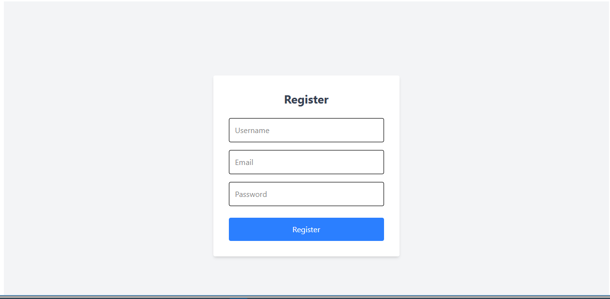
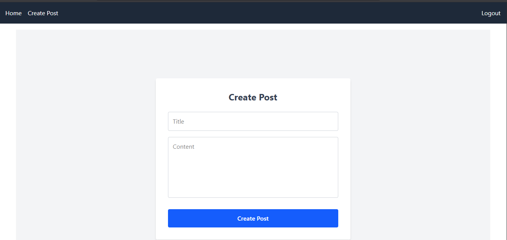

---
## Getting Started

1. Clone the repository:
   ```bash
   git clone <your-repo-url>
   cd mern-blog

2. cd server
   pnpm install
   cd ../client
   pnpm install
3. Server: cd server && pnpm run dev

   Client: cd client && pnpm run dev

   ## Example Screenshots

### Login Page


### register List Page


### Create Post Page

